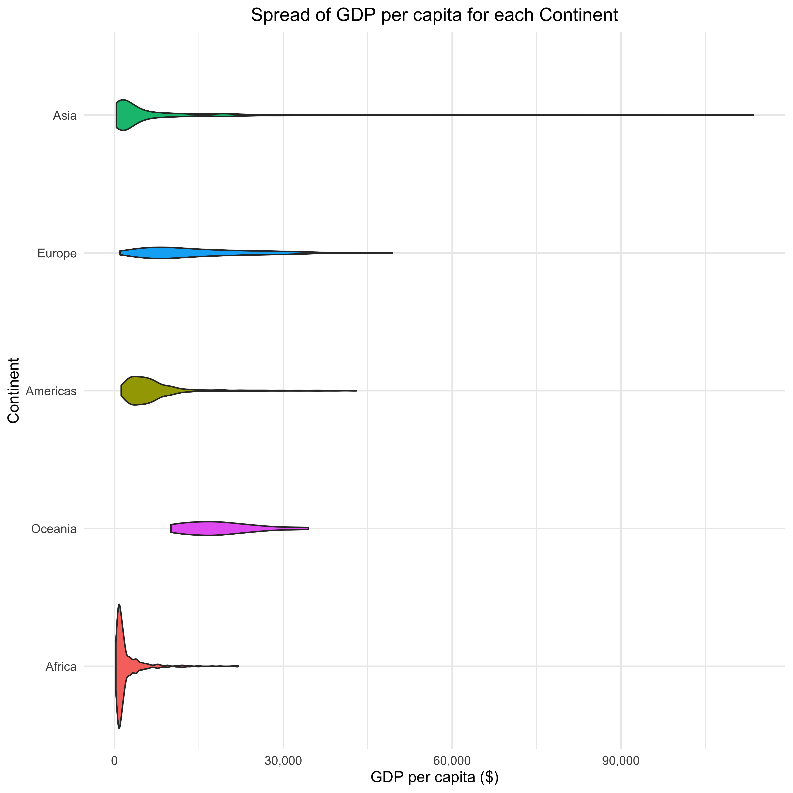

```{r setup, include=FALSE, warning=FALSE}
knitr::opts_chunk$set(echo = TRUE)
```

```{r}
library(gapminder)
library(tidyverse)
library(dplyr)
library(forcats)                    
library(ggplot2)
library(gridExtra)
```

## Exercise 1: Explain the value of the here::here package

After reading the blog post written by Malcolm Barrett, there appears to be great value in using the here::here package. With this package you can detect the root directory and it creates platform-independent file paths that can be accessed by different operating systems. Thus, in the long run this allows for better management of subdirectories and also consequently allows for other individuals to download and easily run the code produced. This is in contrary to using setwd(), which involves the creation of a more personalized file path that isn't exactly compatible or user-friendly for peers. 

## Exercise 2: Factor management- gapminder dataset

Below you can see that the gapminder dataset has 1704 rows and 5 levels of continents (corresponding to Oceania, Africa, Asia, Europe and the Americas). This is also exemplified with the str() function, which displays 1704 observations and 6 variables (country, continent, year, lifeExp, pop and gdpPercap). Additionally, when filtering the gapminder dataset to just Oceania, it shows that for this continent there are 24 rows of observations. 
  `
```{r}
gapminder %>% 
  nrow() 

gapminder$continent %>% 
  nlevels()

str(gapminder)

gapminder %>% 
  filter(continent== "Oceania") %>% 
  nrow()
```

Next we will remove observations associated with Oceania from the gapminder dataset. We know that gapminder has 1704 rows and Oceania alone has 24; therefore, the new dataset will have a total of 1680 rows with 4 levels of continents (Africa, Americas, Asia, and Europe) only. 

```{r}
gapminder_ExcludOceania <- gapminder %>% 
  filter(continent != "Oceania") %>% 
  droplevels()

gapminder_ExcludOceania %>% 
  nrow()
  nlevels(gapminder_ExcludOceania$continent)
  levels(gapminder_ExcludOceania$continent)
  
str(gapminder_ExcludOceania)  
```

Below is the gapminder dataset, where I selected for continent, country and their GDP per capita. 

```{r}
gapminder_Normal <- gapminder %>% 
  group_by(continent) %>% 
  select(continent, country, gdpPercap) %>% 
  mutate('gdpPercap'=round(`gdpPercap`))

DT::datatable(gapminder_Normal)
```

Below I summarised the maximum GDP per capita for each continent.

```{r}
gapminder_Max <-gapminder %>% 
  group_by(continent) %>% 
  summarise("Maximum_GDP"=max(gdpPercap)) %>% 
  mutate('Maximum_GDP'=round(`Maximum_GDP`)) 

DT::datatable(gapminder_Max)
```

I plotted the values that I found in the previous table. 

```{r}
gapminder_Max %>% 
  ggplot() +
  geom_col(aes(x=continent, y=Maximum_GDP, fill=continent)) +
  scale_y_continuous(labels = scales::comma_format()) +
  xlab("Continent") +
  ylab("GDP per capita ($)") +
  theme_minimal() +
  coord_flip() +
  guides(fill="none") +
  ggtitle("Spread of GDP per capita for each Continent") +
  theme(plot.title = element_text(hjust = 0.5))
```

Using the forcats package, I then rearranged the order of the continents from least to greatest GDP per capita.

```{r}
gapminder_Max %>% 
  ggplot() +
  geom_col(aes(x=fct_reorder(continent, Maximum_GDP), y=Maximum_GDP, fill=continent)) +
  scale_y_continuous(labels = scales::comma_format()) +
  xlab("Continent") +
  ylab("GDP per capita ($)") +
  theme_minimal() +
  coord_flip() +
  guides(fill="none") +
  ggtitle("Spread of GDP per capita for each Continent") +
  theme(plot.title = element_text(hjust = 0.5))
```

## Exercise 3: File input/ouput (I/O)

I decided to filter the gapminder dataset so that it narrows down on variables from the continent Asia, and the GDP per capita for each of the countries in 1952. I then selected for continent, country and rounded life epectancies. 

```{r}
gapminder_Asia<-gapminder %>% 
  filter(continent== "Asia", year== "1952") %>% 
  select(country, lifeExp) %>% 
  mutate('lifeExp'=round(`lifeExp`))
 
DT::datatable(gapminder_Asia)
```

First I will write the new filtered data to disk. 

```{r}
write_csv(gapminder_Asia,here::here("gapminder_Asia_file.csv"))
```

Then, I will read the same data from the disk. 

```{r}
read_csv(here::here("gapminder_Asia_file.csv")) 
```

It appears that the I/O method didn't entirely work out the way I expected to i.e. my file only somewhat survived. When transferring from the disk to here, the 'country' variable got changed from a factor to a character. Therefore, I had to change it back myself to being a factor.

```{r}
gapminder_Asia$country <- as.factor(gapminder_Asia$country)

str(gapminder_Asia)
```

I then decided to reorder the factor of country based on life expectancy, such that it is going from lowest to highest age. 

```{r, fig.width = 10, fig.height = 12}
gapminder_Asia %>% 
  ggplot() +
  geom_col(aes(x=fct_reorder(country, lifeExp), y=lifeExp)) +
  xlab("Country") +
  ylab("Life Expectancy") +
  theme_minimal() +
  coord_flip() +
  ggtitle("Life Expectancies in Asian Countries (1952)") +
  theme(plot.title = element_text(hjust = 0.5))
```

## Exercise 4: Visualization design

Old graph from Assignment 3: dplyr/ggplot2 Part II

```{r, fig.width = 10, fig.height = 10}
ggplot(gapminder, aes(continent, gdpPercap, fill=continent)) +
  geom_violin(alpha=1) +
  scale_y_continuous(labels = scales::comma_format()) +
  xlab("Continent") +
  ylab("GDP per capita ($)") +
  theme_linedraw() +
  guides(fill="none") +
  ggtitle("Spread of GDP per capita for each Continent") +
  theme(plot.title = element_text(hjust = 0.5))
```

New, improved Assignment 3 graph 

```{r, fig.width = 10, fig.height = 10}
ggplot(gapminder, aes(continent, gdpPercap, fill=continent)) +
  geom_violin(aes(fct_reorder(continent, gdpPercap, max))) +
  scale_y_continuous(labels = scales::comma_format()) +
  xlab("Continent") +
  ylab("GDP per capita ($)") +
  theme_minimal() +
  coord_flip() +
  guides(fill="none") +
  ggtitle("Spread of GDP per capita for each Continent") +
  theme(plot.title = element_text(hjust = 0.5))
```
 
Renaming the plots so that they can consequenltly be combined to a figure that contains both of them togeher. 

```{r, fig.width = 10, fig.height = 10}
ggplot_old <- ggplot(gapminder, aes(continent, gdpPercap, fill=continent)) +
  geom_violin(alpha=1) +
  scale_y_continuous(labels = scales::comma_format()) +
  xlab("Continent") +
  ylab("GDP per capita ($)") +
  theme_linedraw() +
  guides(fill="none") +
  ggtitle("Spread of GDP per capita for each Continent") +
  theme(plot.title = element_text(hjust = 0.5))
```

```{r, fig.width = 10, fig.height = 10}
ggplot_new <- ggplot(gapminder, aes(continent, gdpPercap, fill=continent)) +
  geom_violin(aes(fct_reorder(continent, gdpPercap, max))) +
  scale_y_continuous(labels = scales::comma_format()) +
  xlab("Continent") +
  ylab("GDP per capita ($)") +
  theme_minimal() +
  coord_flip() +
  guides(fill="none") +
  ggtitle("Spread of GDP per capita for each Continent") +
  theme(plot.title = element_text(hjust = 0.5))
```

Combining the old and new plots, side by side:

Although the text sizes of the plot and axis titles are shown as larger in this new plot, you can otherwise still see the differences made between my previous and current ggplot, as described above. 

```{r}
grid.arrange(ggplot_old,ggplot_new, ncol=2)
```

I decided to keep the geom_violin() type of ggplot as I feel it portrays the spread of GDP/capita for each continent really nicely, and kept the colour scheme as it helps in distingusihing between continents. I also didn't change the plot title and axis titles as they are concise enough. 

Some changes I did was flipping the coordinates x and y, such that continent is now on the y-axis and GDP per capita is on the x-axis. Additionally, the continents were ordered from maximum (Asia) to minimum (Africa) GDP per capita. I changed the theme to minimal in order to get rid of the black border, which gave it a more clean and simple look. 

## Exercise 5: Writing figures to file 

Here I saved the new plot I created in the previous exercise to file. I then loaded and embedded it to this report. 
```{r}
ggsave(filename= here::here("ggplot_new.png"), plot=ggplot_new, dpi=500, height=20, width=20, units="cm")
```




